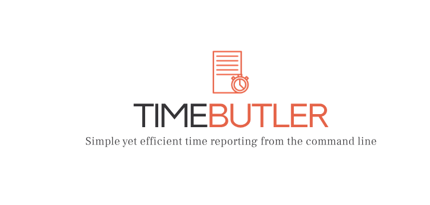

# time-butler


- [time-butler](#time-butler)
  - [License](#license)
  - [Description](#description)
  - [Functions](#functions)
    - [Modes](#modes)
    - [Logging](#logging)
    - [Add \& Remove](#add--remove)
    - [Report](#report)
    - [List](#list)
    - [Target](#target)
    - [Modify](#modify)
    - [Info](#info)
  - [Building](#building)
    - [Installation](#installation)
    - [Development run](#development-run)
  - [App](#app)
    - [Environment](#environment)
    - [Storage](#storage)
  - [Documentation](#documentation)
  - [Usage](#usage)
    - [Intended workflow](#intended-workflow)
      - [Working hours per day](#working-hours-per-day)
      - [Working hours on a project](#working-hours-on-a-project)
  - [Roadmap](#roadmap)

## License
[](https://choosealicense.com/licenses/mit/)

## Description
**TimeButler** aims to be your quick go-to tool for simple time reporting. It's easy to interact with through the command line and supports the basic tasks needed for time reporting.

Fully developed in rust for personal use, but it can probably help more people then me to simplify understanding of where time is being spent.

## Functions

### Modes
**TimeButler** can be used in two different ways from the command line, either the default `direct`  or `interactive`.

```bash
# Interactive
$ time-butler interactive
Welcome to the TimeButler's interactive mode!
Here you will be guided through the functionalities of the program.

More functionalities will be added in the future. Use CLI for full set of features.

Please select an option:
1. Add a new project
2. Add a new entry to a project
3. Add a new work day
4. List project or projects
5. List entry or entries for a week
6. Exit

```

```bash
# Add new day with starting time through the direct mode
$ time-butler add day --starting-time
```
### Logging
The application provides informative logging by default, but `verbose` logging can be enabled with a flag
`$ time-butler --verbose <command>`

### Add & Remove
Following [types](doc/readme_support/types.md) can be added and removed from tracking:
* **Project** - A project where time entries can be attached to
* **Entry** - A time entry
* **Day** - Similar to a time entry, but not connected to a project. Instead added to the current week.

### Report
Generates time reports for a `week`, `month` or `project` in following formats:
* json
* csv
* yaml
* html

### List
Similar to `Report` but only lists [weeks](<path>) or [projects](<path>) direct in the shell. Possible list options are:
* all-weeks - List overview of all weeks in storage
* all-project - List overview of all projects in storage
* week - List all days in specific week number
* project - List all entries in specific project

### Target
Displays the amount of registered time compared to a set target.

In the future, the possibility of setting the target hours for a project, month and week. Initial version will have hard coded targets to **40h/week** and **160h/month**.

### Modify
**to-be-implemented**

### Info
**to-be-implemented**

## Building
Cargo is used for building and installation. At the time of writing, nothing is pushed to [creates.io](https://crates.io/)

```bash
# Clone sources
$ git clone <repo-path> && cd time-butler

# Build release with cargo
$ cargo build --release
```

### Installation
```bash
# From repo root
$ cargo install --path .
```

### Development run
```bash
RUST_LOG=debug cargo run -- <command-to-run>
```

## App

### Environment
time-butler is to start with, only supported in linux.

### Storage
By default, time-butler uses following path as a work directory: `/home/$USER/.local/time-butler`.
All generated reports etc. will be found at a corresponding sub-directory and easy to understand.

## Documentation
Todo: Add instructions for cargo docs and more if needed

## Usage
For detailed usage info, use the `--help`.

### Intended workflow
The idea is to create a simple but yet effective way of tracking the time spent on different tasks during a day. The following workflow was in mind when writing the `time-butler`:

#### Working hours per day
A simple *stamp clock* approach. You check in at the start of the day:
```bash
time-butler add day --starting-time
```

And check out in the end of the day. An extra note or description can also be added for convenience.
```bash
time-butler add day --ending-time --extra-info "Worked with something fun!"
```

#### Working hours on a project
Log time to a ongoing project directly:
```bash
time-butler add entry --project <my_project> --hours 8 --description "Fixed a bug"
```

**Note:** The project needs to be added before entries can be added to it. See *examples* [here](doc/readme_support/types.md)

## Roadmap
**Version 1.0.0**
- [X] Add new project
- [X] Add new project entry
- [X] Add new Day, with automatic week creation
- [X] Be able to create a report file based on stored time in both week and project
- [X] Implement suitable logging
- [X] User should be able to interact with the `time-butler` both static and interactive via the cli
- [X] Removal of project
- [X] Removal of day
- [X] List current stored project
- [X] List current stored entries in specific project
- [X] List current stored weeks
- [X] List current stored Days in specific week
- [X] Option for getting simple information regarding current state of time-butler
- [X] First version of a *okey* project readme
- [X] Add building instructions
- [ ] Basic tests
- [X] Basic github actions pipeline setup
- [X] Improve the hour calculation in Day, to take minutes in to account
- [ ] Update project hours type to float. Will brake existing serializing for current users.
- [ ] Fix all `clippy` warnings
- [ ] Read settings (storage path etc) from config files places under /home/user/.conf/time-butler/time-butler.conf
- [X] Add Target, with status for stored time containers
- [X] Verify all the document comments for cli. Make sure they are updated and correct.
- [ ] Refactor out the butler table functions to a separate file.

**Version 1.1.0**
- [ ] Full Implement the *info* command.
- [X] Add month as a option for reports
- [ ] Add year as a option for reports
- [ ] Implement the *modify* command
- [ ] Removal of week
- [ ] Add a simple backup function, to store files managed by the butler
- [X] Create a verification function for storage of years. If you have week1 in both 2025 and 2024 it has be handled by year. Possible solution to add the year in the struct as well.
- [ ] Add functionality in day, to talk in the lunch time in hours worked. Should be a default value + config
- [ ] Refactor the Target *todos*

