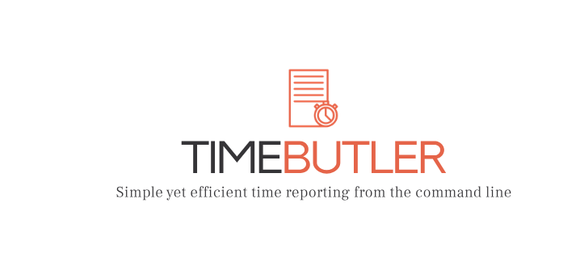

# time-butler


- [time-butler](#time-butler)
  - [License](#license)
  - [Description](#description)
  - [Functions](#functions)
    - [Modes](#modes)
    - [Logging](#logging)
    - [Add \& Remove](#add--remove)
    - [Report](#report)
    - [List](#list)
    - [Target](#target)
    - [Modify](#modify)
    - [Info](#info)
  - [Building](#building)
    - [Installation](#installation)
    - [Development run](#development-run)
  - [App](#app)
    - [Environment](#environment)
    - [Storage](#storage)
  - [Documentation](#documentation)
  - [Usage](#usage)
    - [Intended workflow](#intended-workflow)
      - [Working hours per day](#working-hours-per-day)
      - [Working hours on a project](#working-hours-on-a-project)
  - [Roadmap](#roadmap)

## License
[](https://choosealicense.com/licenses/mit/)

## Description
**TimeButler** aims to be your quick go-to tool for simple time reporting. It's easy to interact with through the command line and supports the basic tasks needed for time reporting.

Fully developed in rust for personal use, but it can probably help more people then me to simplify understanding of where time is being spent.

## Functions

### Modes
**TimeButler** is easy and intuitive to use:

```bash
# Add new day with starting time
$ time-butler add day --starting-time
```
### Logging
The application provides informative logging by default, but `verbose` logging can be enabled with a flag
`$ time-butler --verbose <command>`

### Add & Remove
Following [types](doc/readme_support/types.md) can be added and removed from tracking:
* **Project** - A project where time entries can be attached to
* **Entry** - A time entry
* **Day** - Similar to a time entry, but not connected to a project. Instead added to the current week.

### Report
Generates time reports for a `week`, `month` or `project` in following formats:
* json
* csv
* yaml
* html

### List
Similar to `Report` but only lists [weeks](<path>) or [projects](<path>) direct in the shell. Possible list options are:
* all-weeks - List overview of all weeks in storage
* all-project - List overview of all projects in storage
* week - List all days in specific week number
* project - List all entries in specific project

### Target
Displays the amount of registered time compared to a set target.

The possibility of setting the target hours for a month and week. Default targets will set to **40h/week** and **160h/month**. Target values 
can be updated in the configuration file.

### Modify
Modifies an already reported day or created project. It's easly done by using the **ID** of the Day/project and the new field you want to update. 
All fields can not be modified, but some of them will be updated based on a modified field if they have a relation. 

In order to update the starting time of a day, following exmaple command can be used
```bash
time-butler modify day --id <unique_id> --new-starting-time "<new_starting_time>"
```

Here the time format has to be `RFC3339` => "2026-05-01T08:00:00Z". 

The project fields are modified in the same way. For detailed help
```bash
time-butler modify --help
```

**Note**: A project time entry can't be modified, instead remove it and create a new one. 

### Info
**to-be-implemented**

## Building
Cargo is used for building and installation. At the time of writing, nothing is pushed to [creates.io](https://crates.io/)

```bash
# Clone sources
$ git clone <repo-path> && cd time-butler

# Build release with cargo
$ cargo build --release
```

### Installation
```bash
# From repo root
$ cargo install --path .
```

### Development run
```bash
RUST_LOG=debug cargo run -- <command-to-run>
```

## App

### Environment
time-butler is developed on **linux** for **linux**. Other OSes are supported but not really in focus. Hence all documentation and examples are written for linux. If you use a non linux OS and find any issues, please report it. 

### Storage
By default, time-butler uses following path as a work directory: `/home/$USER/.local/time-butler`.
All generated reports etc. will be found at a corresponding sub-directory and easy to understand.

The file names, and storage path's can be changed by passing a custom configuration file as argument. Details can be found (here)[doc/readme_support/configuration.md]

### Backups
By default semi-automated backups of data will be done on a defined time interval. Reason for it to be semi-automated is that `time-butler` will do it without the
user interaction. However, the butler still need to be executed since it's not running as a daemon. Time data is stored in a deticated backup directory. 
The interval and location can be changed from the config file.

A backup can also be force triggered by the user from the **CLI** using the `backup` command:

```bash
time-butler backup --now
```

## Documentation
Todo: Add instructions for cargo docs and more if needed

## Usage
For detailed usage info, use the `--help`.

### Intended workflow
The idea is to create a simple but yet effective way of tracking the time spent on different tasks during a day. The following workflow was in mind when writing the `time-butler`:

#### Working hours per day
A simple *stamp clock* approach. You check in at the start of the day:
```bash
time-butler add day --starting-time
```

And check out in the end of the day. An extra note or description can also be added for convenience.
```bash
time-butler add day --ending-time --extra-info "Worked with something fun!"
```

If time should be excluded from the day for some reason (lunch maybe) it can be added with the `--paused-hours` argument. The day checkout would then look like:
```bash
time-butler add day --ending-time --extra-info "Worked with something fun!" --paused-hours 1
```

#### Working hours on a project
Log time to a ongoing project directly:
```bash
time-butler add entry --project <my_project> --hours 8 --description "Fixed a bug"
```

**Note:** The project needs to be added before entries can be added to it. See *examples* [here](doc/readme_support/types.md)

## Roadmap
**Version 1.0.0**
- [X] Add new project
- [X] Add new project entry
- [X] Add new Day, with automatic week creation
- [X] Be able to create a report file based on stored time in both week and project
- [X] Implement suitable logging
- [X] User should be able to interact with the `time-butler` both static and interactive via the cli
- [X] Removal of project
- [X] Removal of day
- [X] List current stored project
- [X] List current stored entries in specific project
- [X] List current stored weeks
- [X] List current stored Days in specific week
- [X] Option for getting simple information regarding current state of time-butler
- [X] First version of a *okey* project readme
- [X] Add building instructions
- [ ] Basic tests
- [X] Basic github actions pipeline setup
- [X] Improve the hour calculation in Day, to take minutes in to account
- [X] Update project hours type to float. Will brake existing serializing for current users.
- [X] Fix all `clippy` warnings
- [X] Read settings (storage path etc) from config file
- [X] Add Target, with status for stored time containers
- [X] Verify all the document comments for cli. Make sure they are updated and correct.
- [X] Refactor out the butler table functions to a separate file.
- [X] Implement the *modify* command
- [X] Add initial pause function to a day, in order to exclude total work hours
- [X] Implement storage file version check in order to safe-guard reported time from being overwritten or corrupted.

**Version 1.1.0**
- [ ] Full Implement the *info* command.
- [X] Add month as a option for reports
- [ ] Add year as a option for reports
- [ ] Removal of week
- [X] Add a simple backup function, to store files managed by the butler
- [X] Create a verification function for storage of years. If you have week1 in both 2025 and 2024 it has be handled by year. Possible solution to add the year in the struct as well.
- [ ] Add functionality in day, to set a default paused time per day via config and also how big that pause should be.
- [ ] Refactor the Target *todos*

